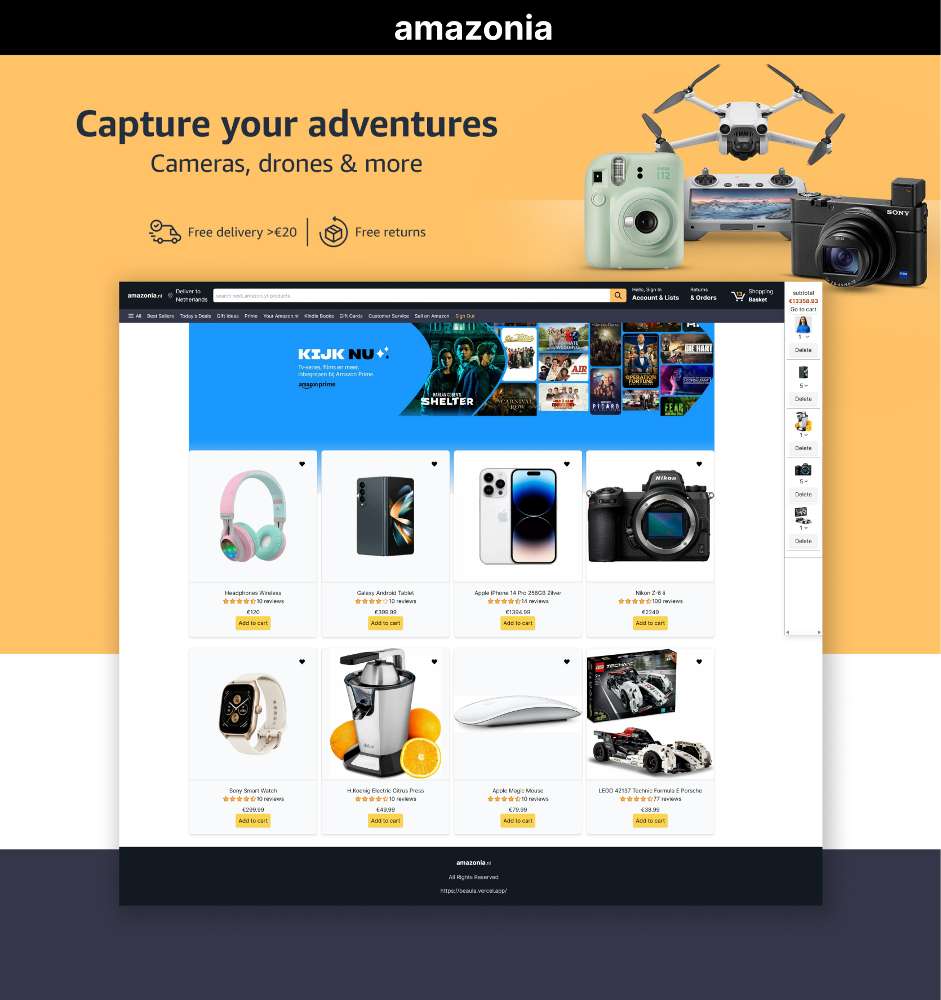
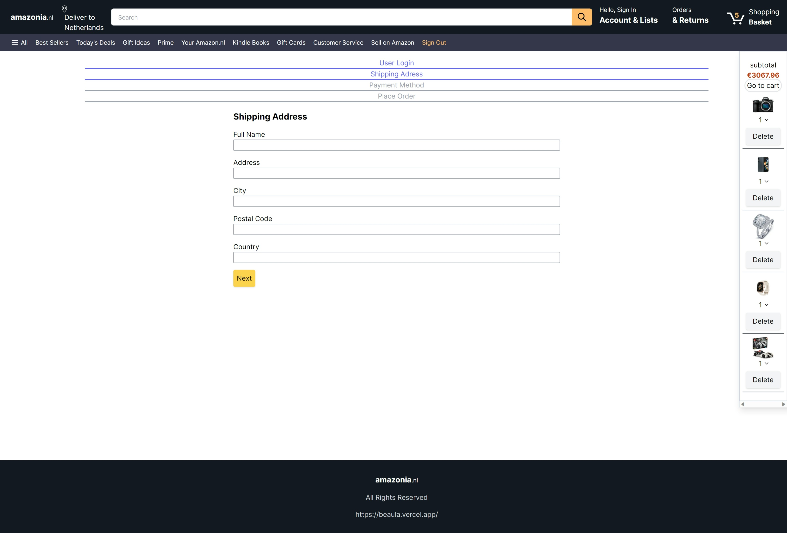
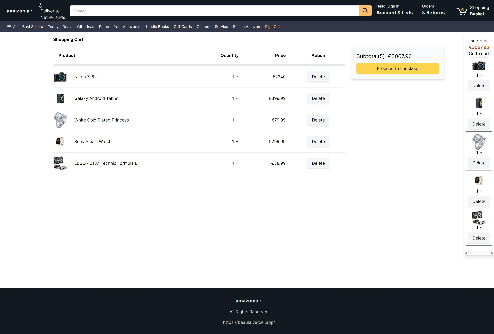
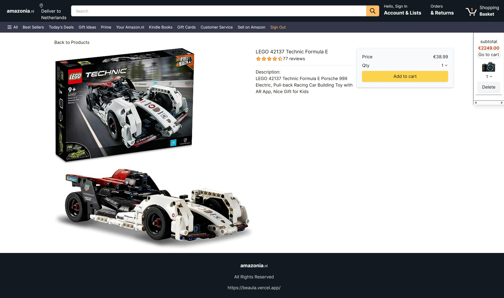

# Amazonia

[https://amazonia-three.vercel.app/](https://amazonia-three.vercel.app/)

Experience the thrill of a fully functional Amazon clone built from scratch for my portfolio project. Leveraging the power of Redux Toolkit and Tailwind CSS, this project showcases my skills in state management, responsive design, authentication and frontend development.

By bringing together Redux Toolkit and Tailwind CSS, I've not only crafted an Amazon clone that mirrors the original's functionality but also showcases my ability to harness cutting-edge tools to create a polished and professional portfolio piece.

# Table of contents

- [Overview](#overview)
- [Screenshots](#screenshot)
- [My Process](#my-process)
- [What I Learnt](#what-i-learned)
- [Continued Development](#continued-development)
- [Author](#author)

## Screenshot






This is a [Next.js](https://nextjs.org/) project bootstrapped with [`create-next-app`](https://github.com/vercel/next.js/tree/canary/packages/create-next-app).

## My Process

- [Built with](#built-with)
- [What I Learned](#what-i-learned)
- [Continued development](#continued-development)

### Built with:

- Redux Toolkit: Leveraged the power of Redux Toolkit for efficient state management, enhancing the functionality of the Amazon clone and showcasing proficiency in handling complex application states.
- Tailwind CSS: Utilized Tailwind CSS for responsive design, ensuring a seamless and visually appealing user experience on various devices.
- React: Employed React as the core library for building the user interface, allowing for the creation of dynamic and interactive components.
- Development Tools:
- JavaScript (ES6+): Implemented modern JavaScript for writing clean and efficient code, enhancing the overall development process.
  Git and GitHub: Utilized version control with Git and hosted the project on GitHub, facilitating collaboration and tracking changes.

### What I Learned

- State Management with Redux Toolkit:
  Acquired expertise in state management by integrating Redux Toolkit, optimizing the handling of application states and improving overall performance.

- Responsive Design with Tailwind CSS:
  Mastered the art of responsive web design using Tailwind CSS, ensuring a seamless user experience across various screen sizes and devices.

- Full Stack Development with React:
  Strengthened frontend development skills through the creation of dynamic user interfaces with React, showcasing proficiency in building modern web applications.

### Continued Development

- This Amazon clone project served as a testament to my skills in frontend development, state management, and responsive design. To further enhance this portfolio piece, I plan to:

- Payment Integration:
  Integrate payment functionality to mimic the full shopping experience on the Amazon clone, incorporating secure and seamless transaction processes.

- User Authentication:
  Implement user authentication features to personalize the shopping experience and enhance security for users.

- Advanced Search and Filtering:
  Enhance search and filtering capabilities, providing users with a more efficient and tailored shopping experience.

- Mobile App Compatibility:
  Explore adapting the Amazon clone for mobile applications, ensuring accessibility and usability on a broader range of devices.

I look forward to continuing the development of this Amazon clone, refining its features, and incorporating new elements to showcase a constantly evolving skill set.

## Author

- Linkedin - [Beaula Ekka-linkedin](https://www.linkedin.com/in/beaula-ekka-favejee-97316558/)

## Getting Started

First, run the development server:

```bash
npm run dev
# or
yarn dev
# or
pnpm dev
```

Open [http://localhost:3000](http://localhost:3000) with your browser to see the result.

You can start editing the page by modifying `app/page.js`. The page auto-updates as you edit the file.

This project uses [`next/font`](https://nextjs.org/docs/basic-features/font-optimization) to automatically optimize and load Inter, a custom Google Font.

## Learn More

To learn more about Next.js, take a look at the following resources:

- [Next.js Documentation](https://nextjs.org/docs) - learn about Next.js features and API.
- [Learn Next.js](https://nextjs.org/learn) - an interactive Next.js tutorial.

You can check out [the Next.js GitHub repository](https://github.com/vercel/next.js/) - your feedback and contributions are welcome!

## Deploy on Vercel

The easiest way to deploy your Next.js app is to use the [Vercel Platform](https://vercel.com/new?utm_medium=default-template&filter=next.js&utm_source=create-next-app&utm_campaign=create-next-app-readme) from the creators of Next.js.

Check out our [Next.js deployment documentation](https://nextjs.org/docs/deployment) for more details.
